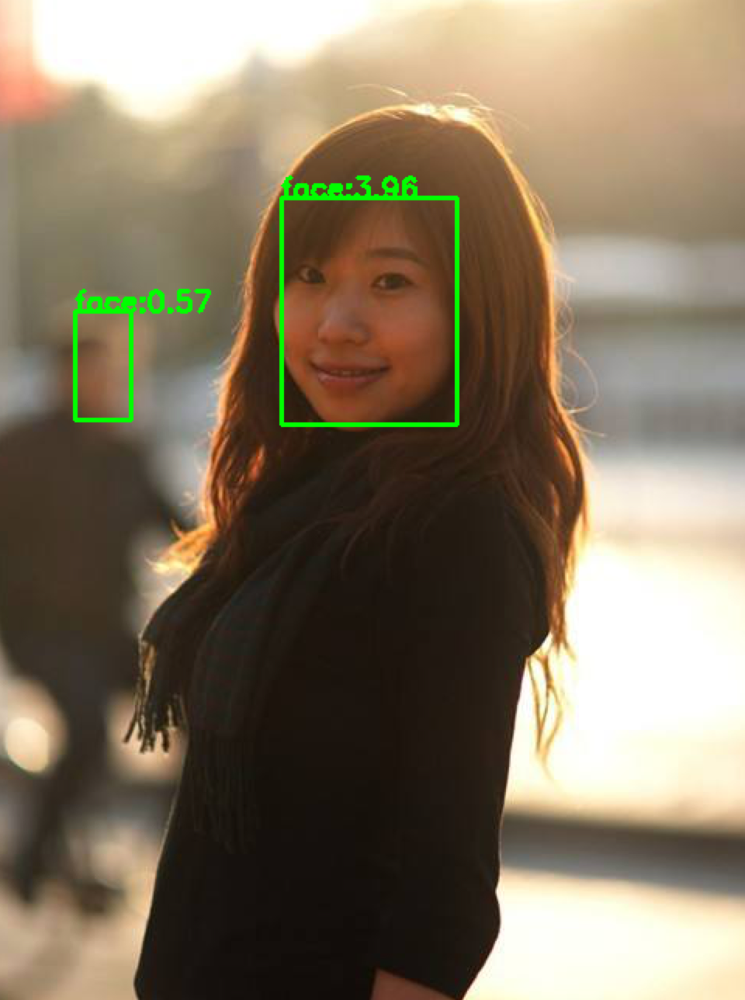
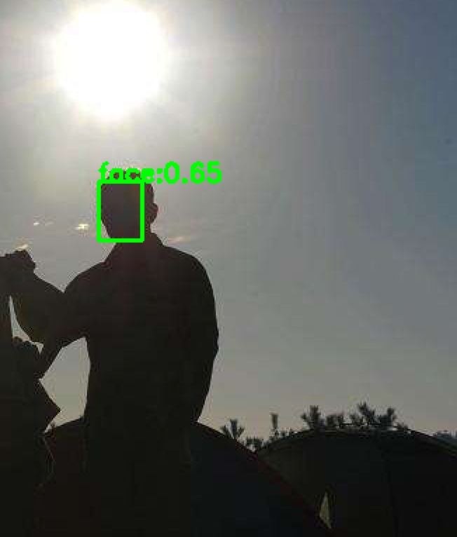
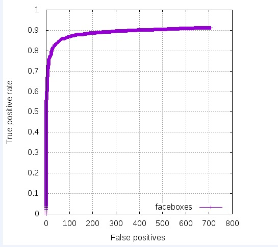

# FaceBoxes

Repository for "[FaceBoxes: A CPU Real-time Face Detector with High Accuracy](http://cn.arxiv.org/abs/1708.05234)", implemented with Caffe, Python interface. 
## Result

### Face Detection
The results of each procedure in FaceBoxes are contained in result folder. The final results are shown in the flowing. 

### Time Cost
The average time cost is 0.15s/frame. The result is generated by testing a 720P live video.

### Accuracy

The accuracy in FDDB which is higher than 0.9. The model contained in  as a pretrain model and improve the result

## How to train

Inatall caff-ssd.

A imdb dataset is necessray to train a model. 

